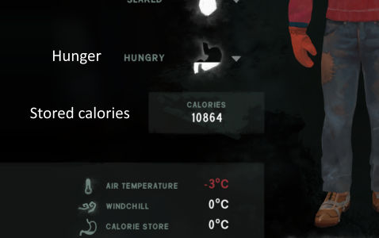
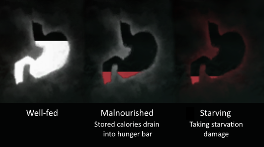

# Hunger Revamped mod for *The Long Dark*

*The Long Dark's* hunger system has some problems:
- It can't differentiate between starving for a few days and starving for months
- It allows players to get by on 600 calories per day, forever
- Calorie deficits don't need to be compensated
- Long-time starvation barely affects the player

### Hunger Revamped

Despite what Hinterland claims, there is simply no way to fix these problems
with just one hunger variable - there is just not enough information.
That's why Hunger Revamped **splits nourishment into 'hunger' and 'stored calories'**.

> 

**Hunger** drains over time and is filled up by eating, just like in the regular game.
When the hunger bar sinks below 20%, you'll slowly start to take starvation damage.
How much damage you take depends on how hungry you are: At first, you'll barely take any damage.
But if you starve yourself for too long, you can take up to 5% damage per hour.

**Stored calories**, on the other hand, represent the player's body fat and thus change rather slowly.
In total, one can store up to 20 000 calories in body fat, which is about a week's worth of energy.
Staying well-nourished by keeping the hunger bar full for some time will slowly accumulate stored calories.
If you're starving, on the other hand, the stored calories are slowly drained into the hunger bar.

That means that if you have lots and lots of stored calories, your hunger bar won't empty all the way,
shielding you from most starvation damage. If you have very few stored calories,
on the other hand, you'll find yourself starving very quickly.

> 

Finally, having lots of stored calories (read: body fat) also gives you a small warmth bonus of up to 2 °C.
But if you've used up your calorie store, your body won't have enough energy to keep your body warm,
resulting in a reduction of your "Feels like" temperature by up to 3 °C.

### Gameplay Effects

#### No more hibernation

Calories can no longer simply be "lost" by completely draining the hunger bar.
The emptier the hunger bar gets, the more calories will be consumed from the calorie store instead.

You *can* still starve yourself during the day and eat before sleeping to regain
some health – but only for some time. The longer you starve yourself, the emptier
your calorie store gets and the faster your hunger bar will drain. This leads to
more and more starvation damage, which you won't be able to compensate for by sleeping.

#### Keeping yourself fed is a challenge

Only having to consume 600 calories per day really made gathering enough food to
survive trivial, even in Interloper. By not being able to cheat the hunger system,
survival is much more of a challenge.

If HungerRevamped still doesn't make this aspect of the game interesting enough,
consider getting [WildlifeBegone](https://github.com/zeobviouslyfakeacc/MiniMods/releases).
This mod makes wildlife much rarer, delaying (or maybe even getting rid of) that point
in the game where you find yourself with a huge pile of food and nothing to do.

#### Start of the game

You'll start with 12 000 stored calories. That means that you'll have a buffer period at the start
of the game during which you don't need to consume much food. This is especially useful in Interloper,
where you find very little food until you can craft a bow and hunt game.

#### Travelling

Having many stored calories also comes in handy when you want to travel to – or find loot in – another region.
Thanks to those stored calories, you won't need to bring as much food, so you'll have more space to carry
more important items. The warmth bonus certainly also helps when you need to spend lots of time outside.

#### Sleeping, fishing, harvesting, breaking down objects

When interacting with the world, you were usually shown how many calories
you'd burn and how many calories were still left in your hunger bar.
With HungerRevamped installed, these two stats aren't of much use.
Instead, all of these screens will now show how full your hunger bar is
and how many calories are stored in body fat **after** that interaction.

This is especially important when **sleeping**. To let your health regenerate,
you need to avoid starvation. You should thus ensure that your hunger bar stays
more than 20% full – if possible.

### Installation

- If you haven't already done so, install the [Mod Loader](https://github.com/zeobviouslyfakeacc/ModLoaderInstaller)
- Head over to the [Releases page](https://github.com/zeobviouslyfakeacc/HungerRevamped/releases) and download `HungerRevamped.dll`
- Move `HungerRevamped.dll` into your mods directory

You can install and use Hunger Revamped in old saves. You'll start with 10 000 stored calories.

You can always uninstall Hunger Revamped and continue playing your save like usual, too,
but the amount of calories stored in body fat will be lost.

### Recommendations

- Don't play in Pilgrim. A better hunger system really doesn't matter if you only consume 50 calories per hour.
- Consider getting [EnableStatusBarPercentages](https://github.com/zeobviouslyfakeacc/MiniMods/releases).
  It lets you see the exact fill levels of your status bar in the status / first aid screen.
